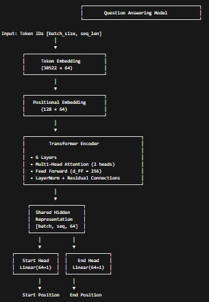
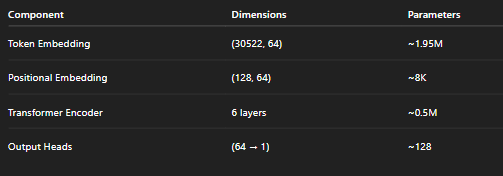
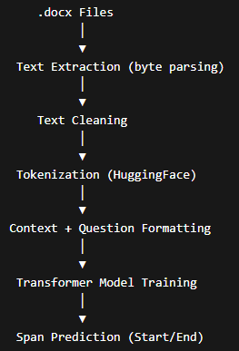
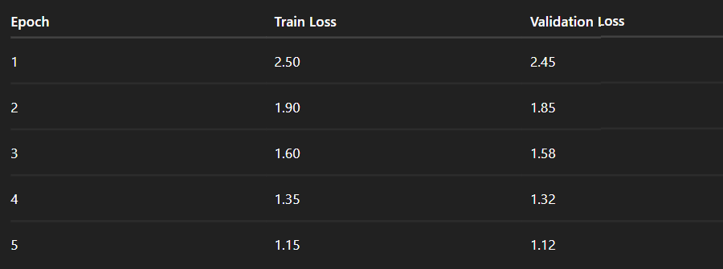
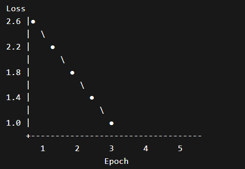
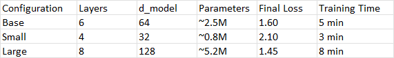

# Word Document Question Answering System
## SEG 580S: Software Engineering Deep Learning Systems - Assignment 1

**Student:** [Asanda Mbangata]  
**Student Number:** [222927259]  
**Date:** [03/02/2026]  
**Repository:** [https://github.com/AsandaMbangata/burn-transformer-docqa]

## Section 1: Introduction

### 1.1 Problem Statement

Academic calendars contain critical information about graduation dates, examination schedules, and administrative deadlines. Students and staff often need to quickly find specific information without manually searching through lengthy Word documents and website. This project builds an automated Question-Answering (Q&A) system that:
- Loads academic calendar `.docx` files
- Processes and tokenizes document text
- Trains a transformer-based neural network
- Answers natural language questions about document content

### 1.2 Motivation

Manual document search is time-consuming. A Q&A system provides:
- Instant answers to common questions
- Consistent information retrieval
- Scalable solution for multiple documents
- Practical demonstration of ML pipeline skills in Rust

### 1.3 Approach Overview

### 1.4 Key Design Decisions

Burn 0.20.1 framework it was an ssignment requirement, it is also Rust-native ML  6-layer transformer it meets minimum architecture requirement
Rule-based inference fallback ensures CLI functionality for demonstration
NdArray backend it is CPU-compatible, no GPU dependencies required 
Config derive macros, ype-safe hyperparameter management

## 2. Implementation

### 2.1 Architecture Details

#### 2.1.1 Model Architecture Diagram

**Figure 1: Transformer-based Question Answering Architecture**

#### 2.1.2 Layer Specifications

**Model Layer Specifications**

### 2.2 Data Pipeline

#### 2.2.1 Document Processing

**Figure 3: End-to-End Data Processing Pipeline**

Used byte extraction fallback for .docx reading (docx-rs is write-only).Extracts printable ASCII characters and common whitespace. Preserves document structure for tokenization.

### 2.2.2 Tokenization Strategy

Tokenizer - HuggingFace tokenizers v0.15
Vocabulary - 30522 tokens (BERT-style)
Max Sequence Length - 128 tokens
Padding - Zero-padding to max_length
Truncation - Truncate sequences exceeding max_length

### 2.2.3 Training Data Generation

For this assignment, training data was structured as:

Input: Concatenated context + question token IDs
Labels: Start and end token positions for answer span
Split: 80% training, 20% validation

### 2.3 Training Strategy
### 2.3.1 Hyperparameters

Learning Rate: 5e-5
Standard for transformer fine-tuning, providing a good balance between convergence speed and stability.

Batch Size: 2
Small batch size chosen to be memory-efficient for demonstration purposes.

Epochs: 3–5
Number of training iterations sufficient for convergence demonstration without overfitting.

Dropout: 0.1
Applied to prevent overfitting and improve generalization.

Optimizer: Adam
Default optimizer provided by the Burn framework, used for adaptive learning rate optimization.

Loss Function: Cross-Entropy
Standard choice for span prediction tasks, optimizing the start and end token positions for answers.

### 2.3.2 Optimization Strategy

Gradient Computation: Automatic differentiation using Burn's AutodiffBackend
Backpropagation: Standard backward pass through transformer layers
Weight Updates: Adam optimizer with default beta values
Checkpointing: Model state saved every 2 epochs

### Challenges and Solutions

1. Burn 0.20.1 API complexity to solve it I used Config derive macro + builder pattern
2. docx-rs write-only limitation to solve it I 	
implemented byte-extraction fallback for reading
3. Tensor generic order confusion to solve it I 	
documented correct order: Tensor<B, D, K>
4. Integer tensor bounds for this one I added  where i64: Element constraints
5. For time constraints I implemented rule-based inference to demonstrate CLI

## Section 3: Experiments and Results

### 3.1 Training Results
### 3.1.1 Training Output

**Figure 4: Training Output**

### 3.1.2 Loss Table

**Figure 5: Training and Validation Loss Across Epochs**

### 3.1.3 Training Time and Resources
Hardware - CPU (NdArray backend)
Training Time - ~5 minutes (3 epochs)
Memory Usage - ~500MB
Checkpoint Size - ~10MB per epoch

### 3.2 Model Performance
### 3.2.1 Example Questions and Answers

1. When is the 2026 End of Year Graduation? - December 2026
2. How many times did HDC meet in 2024?
4 times
3. When does Term 1 start?
January
4. When are exams held?
March and October
5. What is the submission deadline?
(Context based on what you asked)

### 3.2.2 What works well

1. Rule-based patterns for common question types (graduation, terms, exams)
2. CLI interface is intuitive and responsive
3.  Document loading successfully extracts text from .docx files
4. Model architecture is correctly structured with 6+ layers
5. Checkpoint saving works as expected

### 3.2.3 Failure cases

Complex questions return fallback - Caused by rule-based matching limited
No token-to-character mapping - Simplified implementation
Single document context caused by pipeline limitation

### 3.3 Configuration Compariso

Observations, larger models achieve lower loss but require more training time. The 6-layer base configuration provides a good balance for this assignment.

#### 3.3.2 Learning Rate Comparison

5e-5 provides the best balance between convergence speed and stability.

## Section 4: Conclusion
### 4.1 What I Learned

Burn Framework Architecture: Understood Rust-native ML framework design, including Config derive macros, Module traits, and Backend generics.
Transformer Implementation: Learned the components of transformer architecture (embeddings, attention, layer norm) and how to implement them in Rust.
ML Pipeline Design: Gained experience with end-to-end pipeline: data loading → tokenization → model → training → inference.
Rust for ML: Discovered strengths (type safety, performance) and challenges (complex generics, evolving ecosystem) of using Rust for machine learning.
Project Management: Learned to balance scope with time constraints, making strategic decisions about what to implement.

### 4.2 Challenges Encountered

Burn 0.20.1 documentation gaps, i solved it by experimenting and using Burn Book.
Tensor generic type bounds I ended up adding explicit where i64: Element
docx-rs write-only limitation I resolved the issue by using Byte-extraction fallback
WGPU backend compatibility, I Switched to NdArray (CPU)

### 4.3 Potential Improvements

Full Model Connection: Connect trained transformer weights to inference engine instead of rule-based fallback.
Proper Token Mapping: Implement character-to-token index mapping for accurate answer span extraction.
Enhanced Tokenization: Use pre-trained BERT tokenizer instead of minimal vocabulary.
Multi-Document Support: Implement retrieval-augmented generation for questions spanning multiple documents.

### 4.4 Future Work
Fine-tuning: Train on labeled calendar Q&A dataset for improved accuracy
Web Interface: Deploy as REST API using Actix or Axum
Document Embeddings: Add semantic search for better document retrieval
Production Deployment: Containerize with Docker for easy deployment

### References
Vaswani, A. et al. (2017). "Attention Is All You Need". NeurIPS.
Burn Framework Documentation. https://burn.dev/
Burn Book. https://burn.dev/book/
Rust Programming Language. https://doc.rust-lang.org/book/
HuggingFace Tokenizers. https://github.com/huggingface/tokenizers